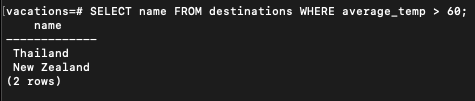
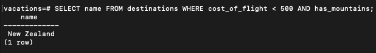
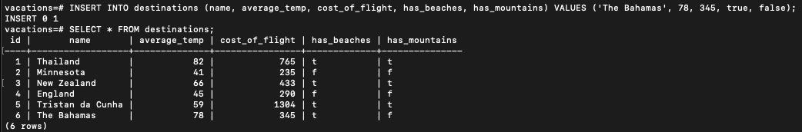
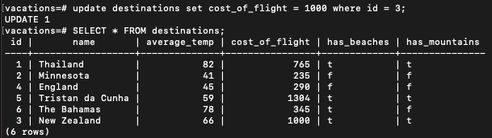
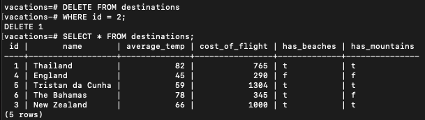
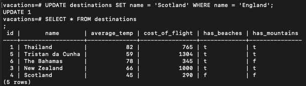
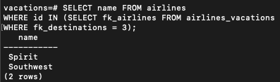
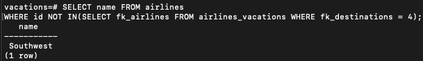
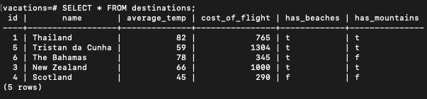

CREATE TABLE destinations (
  id serial,
  name text,
  average_temp integer,
 cost_of_flight integer,
 has_beaches boolean,
has_mountains boolean
);

INSERT INTO destinations (name, average_temp, cost_of_flight, has_beaches, has_mountains) VALUES ('Thailand', 82, 765, true, true);
INSERT INTO destinations (name, average_temp, cost_of_flight, has_beaches, has_mountains) VALUES ('Minnesota', 41, 235, false, false);
INSERT INTO destinations (name, average_temp, cost_of_flight, has_beaches, has_mountains) VALUES ('New Zealand', 66, 433, true, true);
INSERT INTO destinations (name, average_temp, cost_of_flight, has_beaches, has_mountains) VALUES ('England', 45, 290, false, false);
INSERT INTO destinations (name, average_temp, cost_of_flight, has_beaches, has_mountains) VALUES ('Tristan da Cunha', 59, 1304, true, true);

INSERT INTO destinations (name, average_temp, cost_of_flight, has_beaches, has_mountains) VALUES ('The Bahamas', 78, 345, true, false);

Add an entry for The Bahamas, where the average temperature is 78, it has beaches but no mountains, and the flights cost $345.
CREATE TABLE airlines (
  id serial,
  name text
);

INSERT INTO airlines (name) VALUES ('Spirit');
INSERT INTO airlines (name) VALUES ('Lufthansa');
INSERT INTO airlines (name) VALUES ('Delta');
INSERT INTO airlines (name) VALUES ('Southwest');

  THAI 1 NZ 3 SCOT 4 TRIST 5 BAH 6
SPIRIT 1 LUFT 2 DELTA 3 SW 4

SELECT name FROM airlines
WHERE id IN (SELECT fk_airlines FROM airlines_vacations
WHERE fk_destinations = 3);

SELECT name FROM airlines
WHERE id NOT IN (SELECT fk_airlines FROM airlines_vacations WHERE fk_destinations =4);

All airlines that do NOT fly to Scotland.

CREATE TABLE airlines_vacations (
  fk_airlines integer, 
  fk_destinations integer
);

INSERT INTO airlines_vacations (fk_airlines, fk_destinations) VALUES (1,3);
INSERT INTO airlines_vacations (fk_airlines, fk_destinations) VALUES (1,4);
INSERT INTO airlines_vacations (fk_airlines, fk_destinations) VALUES (2,5);
INSERT INTO airlines_vacations (fk_airlines, fk_destinations) VALUES (2,4);
INSERT INTO airlines_vacations (fk_airlines, fk_destinations) VALUES (2,1);
INSERT INTO airlines_vacations (fk_airlines, fk_destinations) VALUES (3,1);
INSERT INTO airlines_vacations (fk_airlines, fk_destinations) VALUES (3,2);
INSERT INTO airlines_vacations (fk_airlines, fk_destinations) VALUES (3,4);
INSERT INTO airlines_vacations (fk_airlines, fk_destinations) VALUES (4,3);
INSERT INTO airlines_vacations (fk_airlines, fk_destinations) VALUES (4,5);
INSERT INTO airlines_vacations (fk_airlines, fk_destinations) VALUES (4,2);
[
  {
    name: "Spirit",
    destinations_flown_to: ["New Zealand", "Scotland"]
  },
  {
    name: "Lufthansa",
    destinations_flown_to: ["Tristan da Cunha", "Scotland", "Thailand"]
  },
  {
    name: "Delta",
    destinations_flown_to: ["Thailand", "Minnesota", "England", "Scotland"]
  },
  {
    name: "Southwest"
    destinations_flown_to: ["New Zealeand", "Tristan de Cunha", "Minnesota"]
  }
]